ParaView 5.8.0 Release Notes
============================

Major changes made since ParaView 5.7.0 are listed in this document. The full list of issues addressed by this release is available
[here](https://gitlab.kitware.com/paraview/paraview/-/milestones/13).

* [New features](#new-features)
* [Rendering enhancements](#rendering-enhancements)
* [Filter changes](#filter-changes)
* [Readers, writers, and sources changes](#readers-writers-and-sources-changes)
* [Interface improvements](#interface-improvements)
* [Python scripting improvements](#python-scripting-improvements)
* [Miscellaneous bug fixes](#miscellaneous-bug-fixes)
* [Catalyst](#catalyst)
* [Developer notes](#developer-notes)

# New features

## HyperTreeGrid additions

There are several new HyperTreeGrid-related features in this release.

Several standard filters such as the **Clip**, **Slice**, **Contour**, and **Threshold** filters  now work for Hyper Tree Grids.

>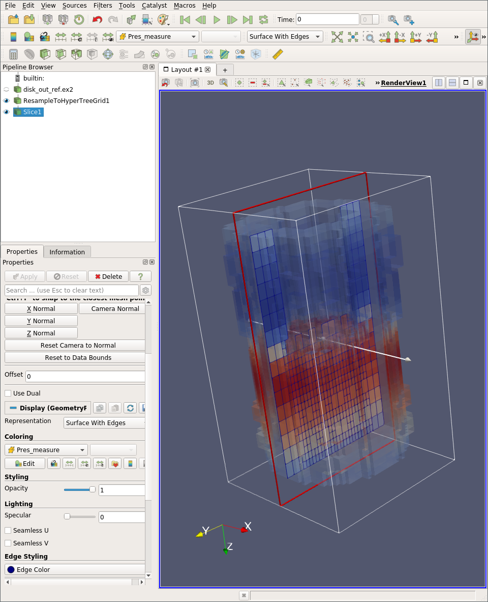
>
> The **Slice** filter applied to a Hyper Tree Grid dataset.

It is now possible to generate ghost cells on Hyper Tree Grids using the **Hyper Tree Grid Ghost Cells Generator** filter. Ghost cells are necessary for any algorithm that relies on Super Cursors with MPI, such as the **Contour** filter. The images below show the difference ghost cells make in contours generated from a Random Hyper Tree Grid Source using MPI on 4 processes.

>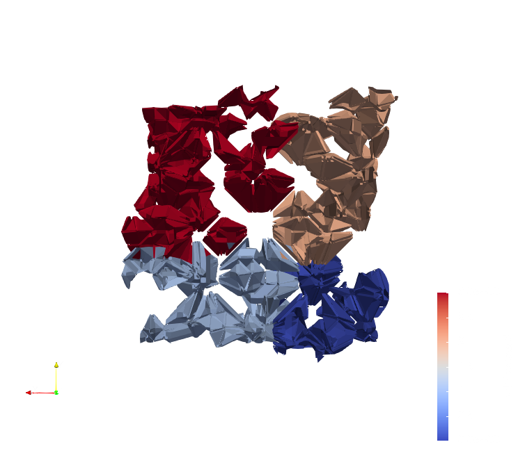
>
> Ghost cells have been computed before the **Contour** filter.

>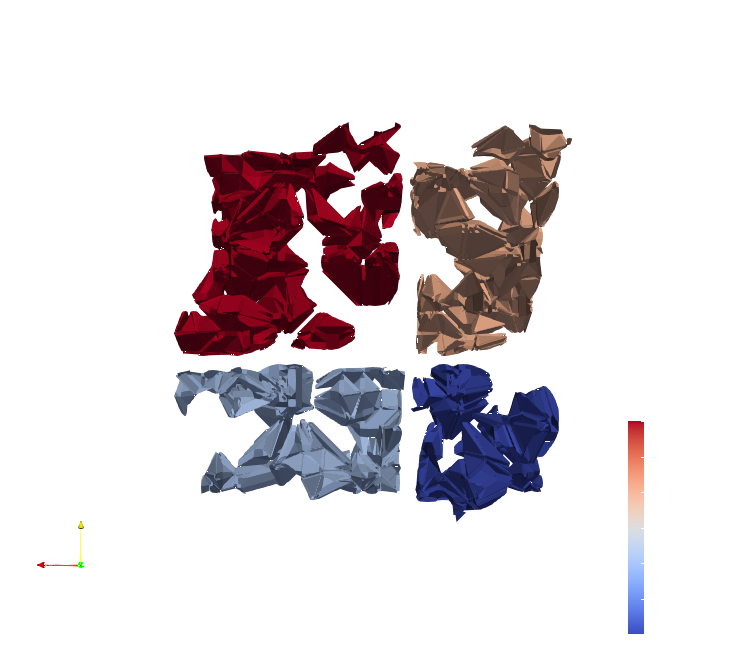
>
> Ghost cells have NOT been computed prior to application of the **Contour** filter.

A new plugin called **HyperTreeGridADR** (ADR is Analysis Driven Refinement) is available in ParaView. This plugin adds a **Resample To Hyper Tree Grid** filter that resamples datasets to Hyper Tree Grids following a metric rule to decide when to subdivide nodes. To use the filter, define a subdivision metric. A node is subdivided if and only if the data it contains is within the chosen metric. A visualization metric is also proposed so you can, for example, decide to subdivide using entropy while being able to visualize the arithmetic mean. This filter enables subdividing point data as well as 3D cell data.

>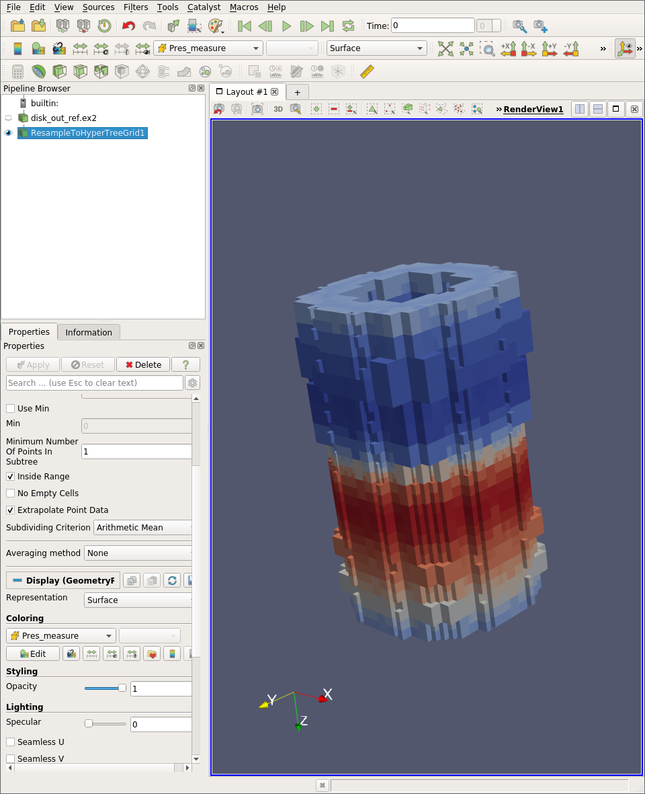
>
> Hyper Tree Grid dataset resampled from an unstructured grid.

The implementation is an adaptation to Hyper Tree Grids of the work of Nouanesengsy et al. 2014: "ADR visualization: A generalized framework for ranking large-scale scientific data using Analysis Driven Refinement" from [LDAV 2014](http://ldav2014.sci.utah.edu/program.html).

## **Calculator** filter operates on `vtkTable` datasets

The calculator filter now accepts `vtkTable` as input. Make sure to select "Row Data" as the *Attribute Type* when working with a table. Columns in the input table will be available as variables in the calculator expression.

## Multiple Expressions in *Find Data* dialog

The *Find Data* dialog now supports finding elements that satisfy multiple logical expressions. Buttons to add or remove expression entries are available. The resulting query is a logical AND combination of the given expressions.

>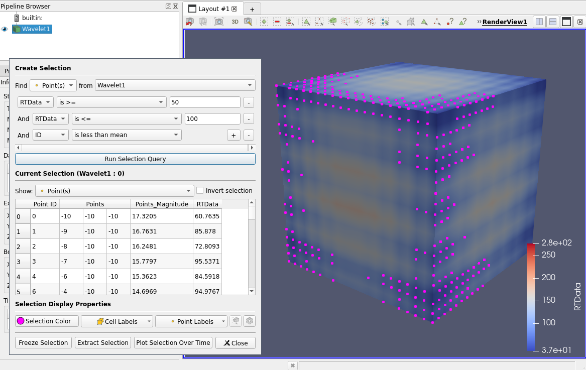

## Links between representation properties

Prior to ParaView 5.8.0, the *Link Editor* allowed creation of links between properties in **Views** and **Sources**, but links between **Representation** properties were not possible. One can now link representation properties. For instance, one can link the **Opacity** property of two representations so that when one is changed, the other is automatically changed the same way
and vice versa. All properties in one representation may also be linked by choosing the "Object Link" mode.

## Grow and shrink selection

Two new selection options have been added to the selection tool bar. The *Grow selection* toolbutton (plus sign icon) expands an existing selection by one layer of cells, while the *Shrink selection* (minus sign icon) shrinks the selection by a layer. A layer consists of any cell that is topologically connected to an outermost existing cell or point in the selection. When growing a cell selection, one layer of cells is added to the existing selection. When growing a point selection, a layer of cells around the existing selection points is identified, and points in those cells are added to the selection.

## Selection by array value

Two new toolbuttons have been added to the render view toolbar that enables interactive selection of  points (cells) by data value. Data values from the current *Color By* array are compared to make the selection. Points (cells) with the same data value as the value associated with the point (cell) currently under the mouse cursor are highlighted for selection in this mode. Clicking the mouse adds these points (cells) to the current selection.  This feature is currently restricted to `vtkIdType` arrays.

## Web export enhancements

The Web exporter for standalone data viewing now preserves dataset names.

## Explanation why a filter cannot be applied

It is now possible again to show why a filter cannot be applied. Just hover on the greyed out filter and look at the status bar for the reason.

>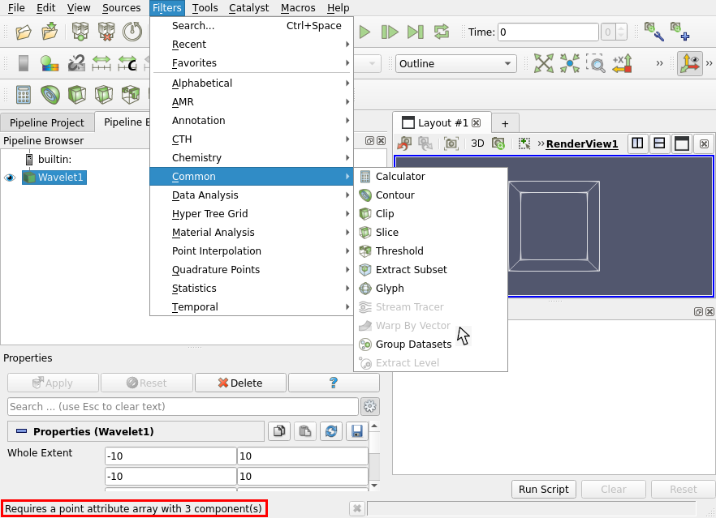

# Rendering enhancements

## OpenVR new features

Several new features have been added to the OpenVR plugin:

* A new **Reset All Positions** option has been added to reset positions
of objects that have been moved using the **Grab** mode.
* A new **Pick** interaction is available that allows grabbing of objects far away with the ray.
* A new option **Interactive Ray** has been added. When enabled, the ray turns green when an
interaction with an object is possible and the ray is cut at its intersection with the object.

## Physically based Rendering and normal mapping

ParaView now supports physically based rendering.

>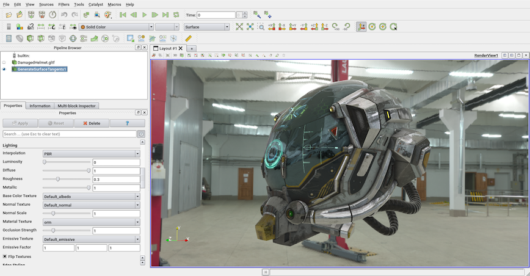

Under the **Lighting** properties group of the **Surface** representation, a new interpolation type
"PBR" can be enabled that provides new properties:

* *Roughness*: define how glossy a material is
* *Metallic*: if a material is metallic or not (you can set any value but for most realistic materials, it should be either 0 or 1)
* *Base Color Texture*: use a texture to define the color
* *Material Texture*: this texture encodes ambient **O**cclusion, **R**oughness, **M**etallic on the Red, Green, Blue channels respectively. This texture is also called ORM.
* *Emissive Texture*: this texture defines which parts of the model emit light.

These new interpolation properties are mapped to the OSPRay `Principled` material when the pathtracer is enabled.

PBR also supports reflections. Select your skybox (in equirectangular projection) and check the `Use As Environment Lighting` option to enable it.

Normal mapping (also called Bump mapping) is now supported by both Gouraud and PBR interpolation. The texture can be selected with the `Normal Texture` property. This texture can be selected if the surface contains texture coordinates and tangents. The tangents can be computed with the new filter `Generate Surface Tangents` (the surface must be triangulated and contain normals and texture coordinates).

## NVIDIA IndeX plugin updated to version 2.4

Added new Custom Visual Element that allow users to write their own volume kernel codes using XAC, NVIDIA IndeX Accelerated Computing Technology. The XAC kernels are small user programable CUDA programs (editable with your preferred text editor) that can be used to replace the default volume shading kernel executed by IndeX. The XAC kernels are compiled by IndeX at runtime, which means that you can load a kernel and edit it on the fly and changes are applied immediately. The new Custom Visual Element provides the means to load a XAC kernel from file, apply updates and provide a list of predefined user parameters that are wired to your kernel.

> 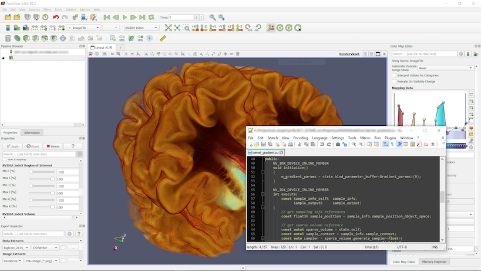
>
> BigBrain Project dataset by courtesy of Prof. Dr. med. Katrin Amunts and the Structural and Functional Organization of the Brain lab at the Institute of Neuroscience and Medicine, Research Centre Jülich.

## Custom labels for charts

It is already possible to define custom ticks on axis in chart views. Now it is possible to display custom labels on those ticks. If no label is specified, the value of the tick is used.

>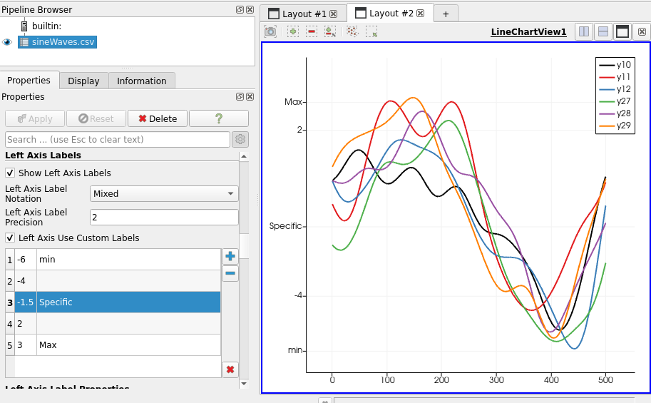

## Improvements to animation caching and performance

ParaView now has refactored caching of rendered data when playing animations with caching enabled. The new changes avoid pipeline updates and data movement when cached data is being used. The cache is now stored on the rendering nodes, thus avoiding the need to delivery data when playing animations. This also includes several cleanups to minimize unnecessary pipeline updates for pipelines that are not impacted by the animation. While such updates are largely no-ops, they still caused lots of bookkeeping code to execute which adversely impacted the performance. [Read more...](https://blog.kitware.com/improving-animation-performance-in-paraview/).

>[](http://www.youtube.com/watch?v=jd7qZTmXJeo "Animation speed improvement with refactored geometry caching.")

This introduces backwords incompatible changes to representations that will affect developers who have custom `vtkPVDataRepresentation` or `vtkPVView` subclasses. Please refer to [Major API Changes](https://kitware.github.io/paraview-docs/nightly/cxx/MajorAPIChanges.html) for details.

## Linear camera interpolation

A new camera interpolation type has been added for controlling the camera during animation.
It interpolates linearly between camera positions; previously, camera positions were always interpolated with a spline function. This new interpolation mode, `Interpolate camera locations (linear)`, is available in the animation view. The previous mode was renamed `Interpolate camera locations (spline)` to avoid confusion.

## Volume slicing using the GPU

A new Volume representation property called *Blend Mode* has been added. This property replaces the old *Show Isosurface* property. Three blend modes are available:
* *Composite*: This is the default volume rendering mode.
* *Isosurface*: This is the replacement of the old `Show Isosurface` property.
* *Slice*: This mode allows the configuration of a slice plane with an interactive widget.

>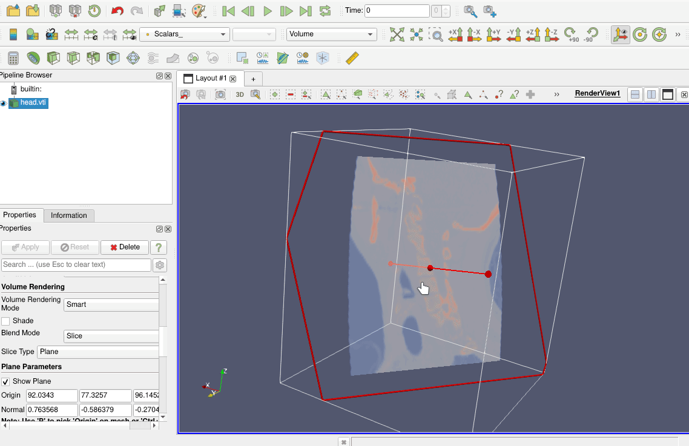

## Cropping volume rendering without filtering

The **Volume** representation now has an option to crop to a volume of interest (VOI) of a 3D image data without the overhead of applying a filter. Check the **Use Cropping** property to enable cropping, and an interactive box widget (with associated text widgets) that enable setting of the axis-aligned VOI region will appear.

>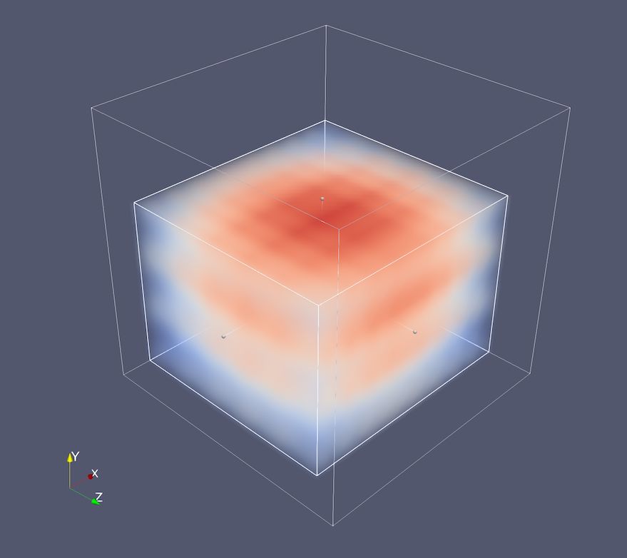

## Flip Book plugin for persistence of vision analysis

ParaView sports a new plugin that creates a new toolbar for a flip book type
rendering mode: when the flip book mode is enabled, every visible representation
in an active RenderView will be flipped at each flip iteration step.
This mode allows use of persistence of vision to perceive differences between
several representations. Note that the SPACE key can be used to flip visibility manually.

>
>
> Additional toolbuttons that control flipbook animation when the Flip Book plugin is loaded.

## New Billboard and Flagpole mode for **Text** source

Two new modes for how to display text in a **Text Source** were introduced in ParaView 5.8. The "Billboard 3D Text" supports displaying a text annotion that is attached to a specific point in the
3D space. The point position can be set explicitly or interactively using the
usual point widget controls.

>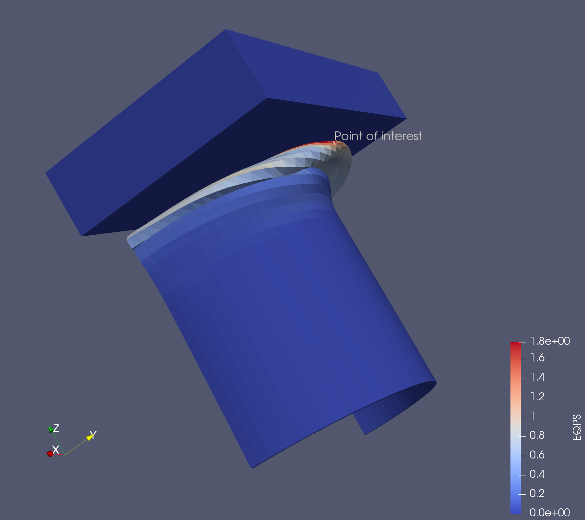


The "Flagpole Actor" mode similarly supports tying a text annotation to a 3D anchor point. In this mode, however, the text has a separate 3D point location, and a line (or "flagpole") is drawn between the anchor point and text point location.

>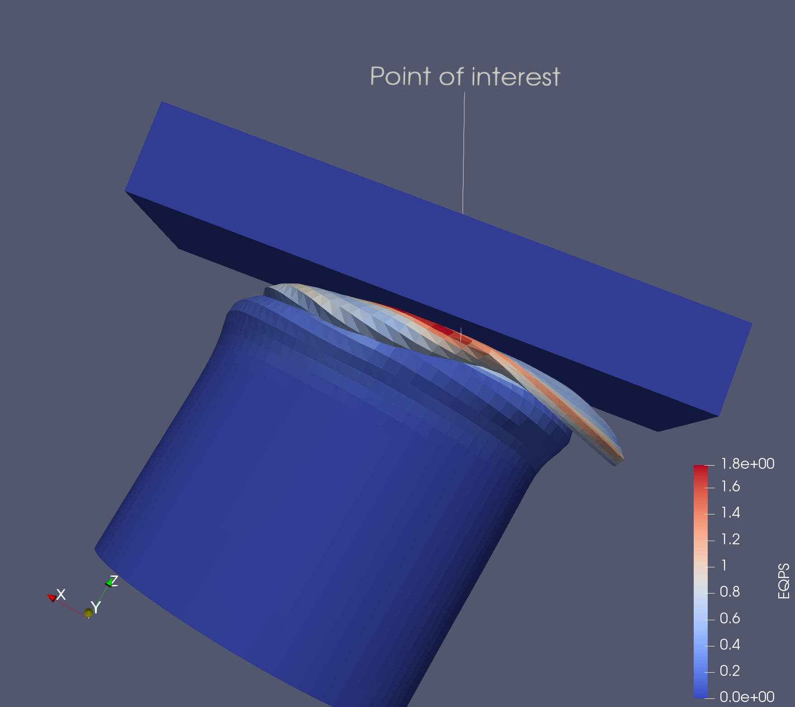

## OpenImageDenoise version update

ParaView can now be compiled with OpenImageDenoise releases newer than 0.8.

# Filter changes

## Redistribute dataset filter

A newly added **Redistribute DataSet** filter is now available. It can be used to split a dataset into the requested number of partitions for load balancing. The filter either computes the bounding boxes, or uses a provided collection of bounding boxes, for distributing the data. By setting the **Boundary Mode** property, cells along partition boundaries can be uniquely assigned to a partition ("Assign to one region"), duplicated among partitions ("Assign to all regions"), or split among the partitions ("Split cells").

## New filter to extract subset from a structured grid starting with a seed point

Sometimes one encounters a multi-block of structured grids that are not aligned in i-j-k space, however the blocks may be adjacent in x-y-z space. In that case, **Extract Subset** does not work as expected since the volume of interest is defined only in i-j-k space. **Extract Subset With Seed** takes in an XYZ location instead and can extract lines or planes in the i-j-k space starting at that point in the dataset and following the structured grid along the requested i-j-k directions.

## **Linear Cell Extrusion** filter

A new filter called **Linear Cell Extrusion** is available. This filter takes a polygonal dataset as input and extrudes its cells along the cell normals to create 3D cells. The extrusion length is determined by the cell data array selected in the **Select Input Scalars** property.

>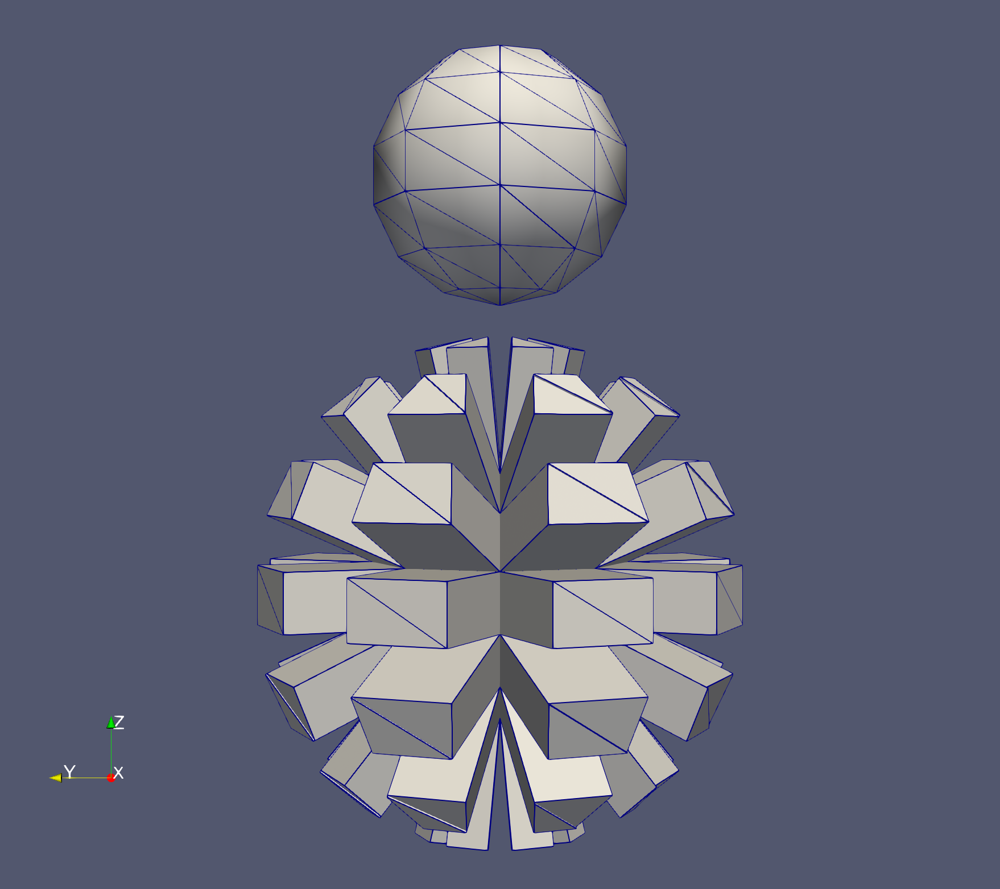

## Generating global point and cell Ids

The newly added **Generate Global Ids** filter can be used to generate global point and cell ids (unique identifiers across parallel ranks) for any dataset. The filter also flags duplicate points using appropriate ghost point flags.

## Explicit refinement for line source points

The **Line** source now supports explicitly specifying intermediate points. This enables generation of non-equidistant sample points along the length of the line. Since **Line** sources are often used to generate probe locations for sampling a dataset, this enables precise control over the probe locations. To use explicitly defined points, uncheck the **Use Regular Refinement** option.

For convenience, ranges of explicit point locations can be generated automatically according to one of several available distributions: "Linear", "Logarithmic", "Geometric (samples)", and "Geometric (common ratio)".

>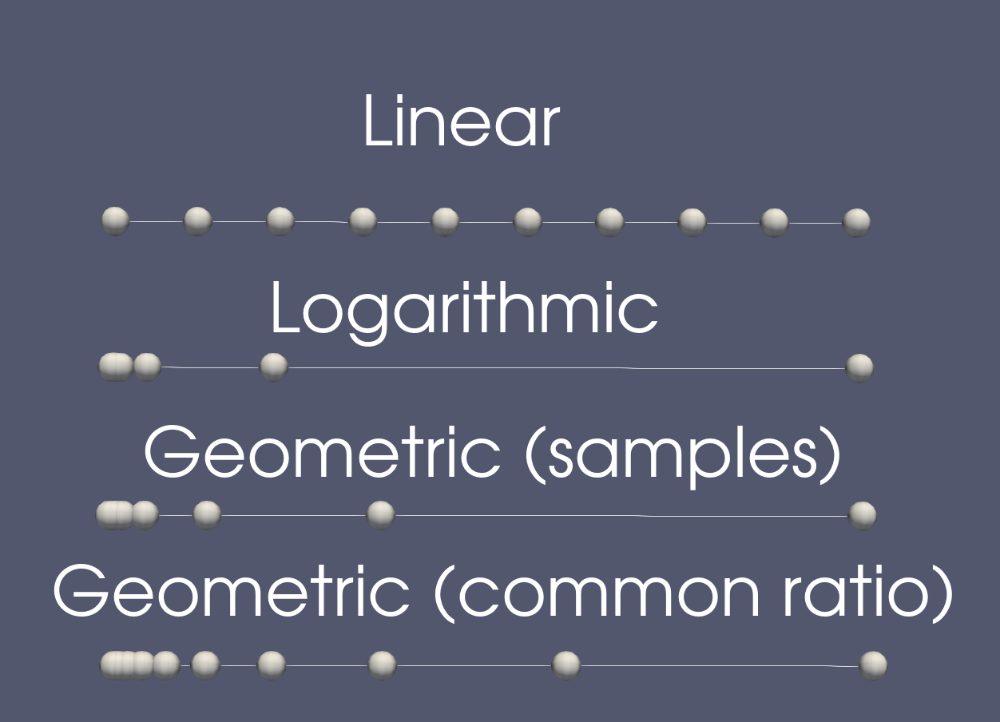

## Tolerance added to **Clean to Grid**

Tolerance properties have been added to the **Clean to Grid** filter to match those already available in the **Clean** filter. A tolerance can be specified, in absolute or relative terms, to determine when points coincide and hence should be merged. With the new tolerance properties, merging can be exactly adapted to the geometry of the problem.

## Seamless UV texture coordinate generation

There is a new lighting option in the **Texture Map to Sphere** filter that enables avoiding seams in U or V parametric directions. When the parameterization wraps in one of those directions, *i.e.* when using a cylindrical or toroidal parameterization, setting this flag on prevents the seam. The **Seamless U** and **Seamless V** options are manually set on or off, and should only be turned on when a texture should wrap around the geometry.

>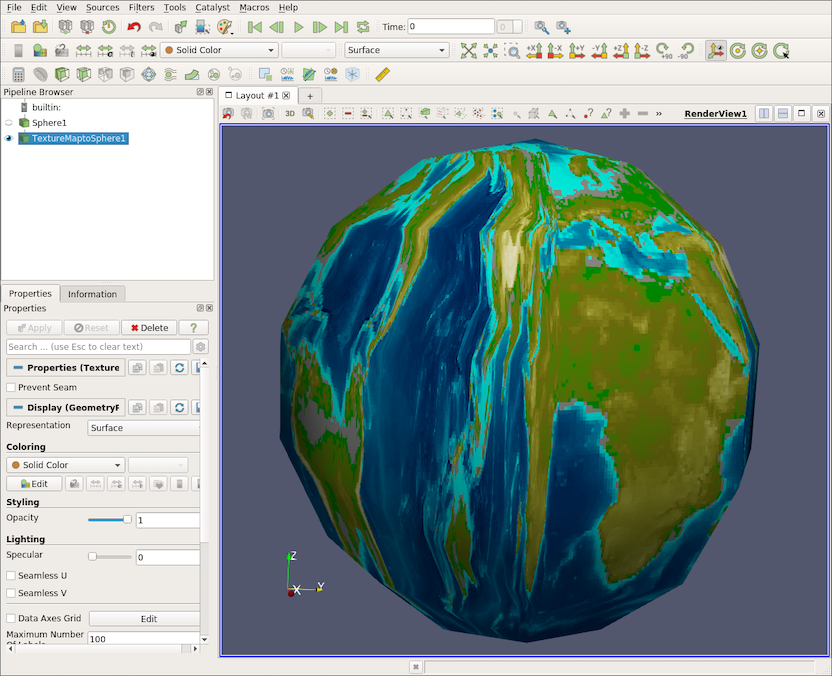
>
> An earth surface image spherically mapped to a sphere with the seamless flags off.

>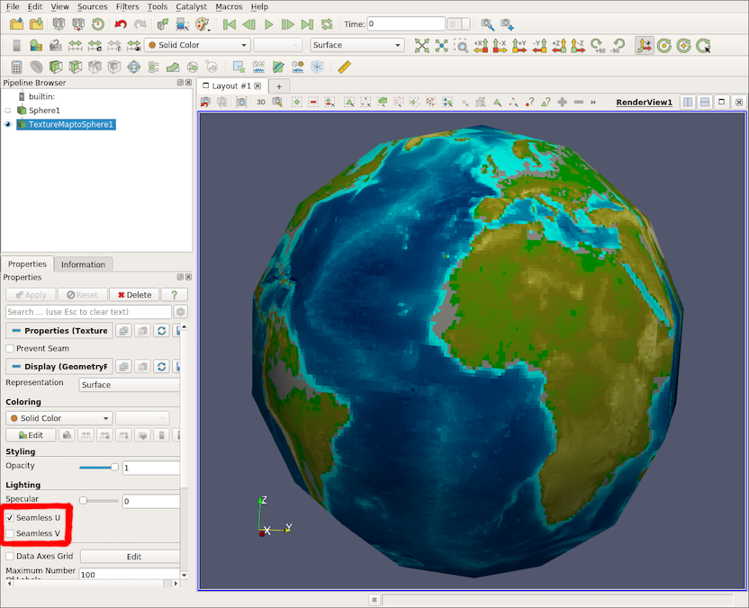
>
> The same earth surface mapping with the seamless flag in the U parametric direction turned on.

## Lagrangian Particle Tracker enhancements

The Lagrangian Particle Tracker multi thread implementation has been improved in order to provide better performance. [Read more...](https://discourse.paraview.org/t/new-multithreaded-lagrangianparticletracker/1838)

# Readers, writers, and sources changes

## Polyhedral mesh support in CGNS reader

The CGNS reader now supports the 3.4 standard for polyhedral meshes.

## New support for ADIOS 2.x readers

ParaView now has support for two different readers using ADIOS 2:

* **ADIOS2CoreImageReader**: Read ADIOS BP files with 2D and 3D image data by explicity specifying the various elements from which to populate metadata.

* **ADIOS2VTXReader**: Read ADIOS BP files which contain metadata in either an attribute or as a file in the .bp directory describing the metadata in VTK XML format. This reader supports `vtkImageData` and `vtkUnstructuredGrid` datasets.

## Reading OME-TIFF files

ParaView now supports mutli-page OME-TIFF files with multiple channels and timesteps. Additional details about the OME-TIFF format can be found at [The OME-TIFF format](
https://docs.openmicroscopy.org/ome-model/5.6.3/ome-tiff/) page. Note that multi-file OME-TIFFs are currently not supported.

## Datamine plugin and reader

Datamine files can now be read in by ParaView. The readers are available after loading the **Datamine** plugin.

## Inline data supported in glTF exporter

The **InlineData** option in the glTF exporter is now exposed in the exporter GUI.

# Interface improvements

## Larger icons in the RenderView toolbar

Icons in the render view toolbar were increased in size from 12 pixels to 24 pixels for increased legibility, especially on HiDPI displays. In addition, these icons were updated to SVG versions, so they can scale to any resolution. A selection of other icons in ParaView's user interface were also updated to SVG.

>
>
> Selection icons in ParaView 5.8 (bottom) have been made larger than they were in ParaView 5.7 (top).

## New data histogram in the *Color Opacity Editor*

The opacity editor widget can now show an optional histogram. It is controlled by the following buttons :
* A checkbox to enable/disable the histogram display
* A button that highlights when the histogram is outdated and recomputes the histogram when clicked
* A checkbox to enable automatic recomputation of the histogram if it is outdated
* A slider to control the number of bins of the histogram

[Read more...](https://blog.kitware.com/paraview-color-map-editor-improvements/)

>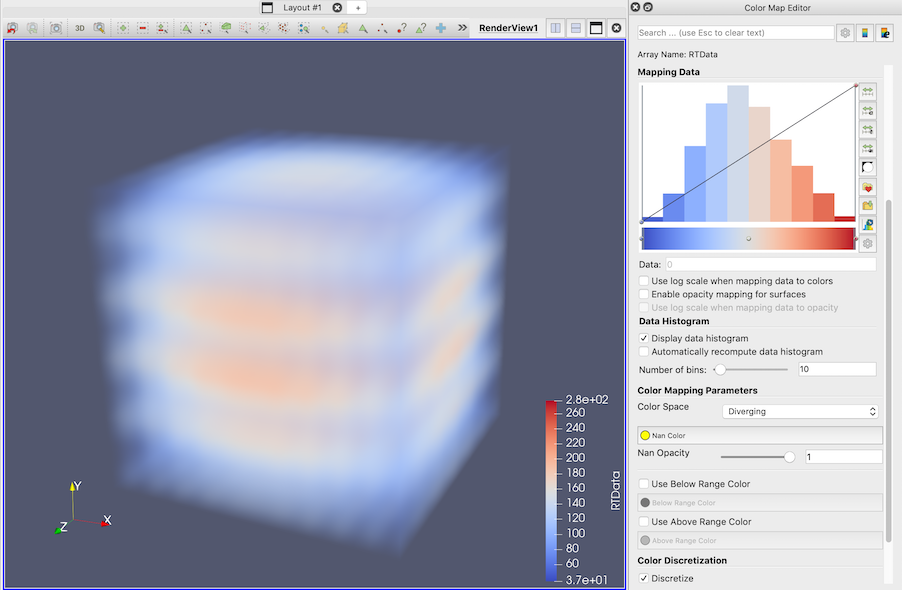

## New range handles in the *Color Opacity Editor*

Range handles are now shown in the color opacity editor widget. They enable easy manipulation of the range of the transfer function. The range is modified interactively by grabbing, moving and releasing one of the range handles. Handles can be dragged outside the current display range to expand the range - the range values are shown in the widget while interacting with the handles. [Read more...](https://blog.kitware.com/paraview-color-map-editor-improvements/)

>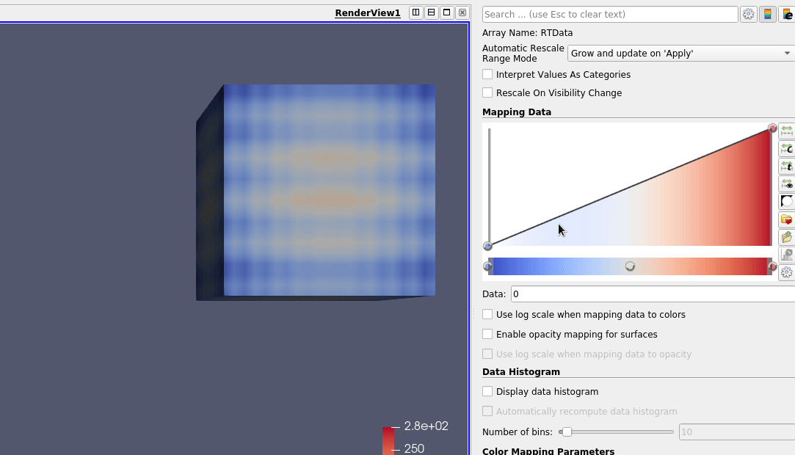

## Light widgets

A new light widget enables interactive changing of a light's position, focal point, and cone angle. Lights of type "Scene" now have a dedicated interactive widget for easier light manipulation and visualization. The widget shows the **Type** of light ("Positional" or "Directional"), the light position, the light focal point and cone angle (for "Positional"), and the light color.

>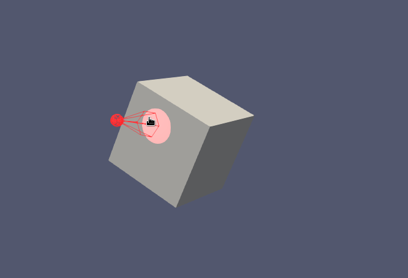

## Copying **SpreadSheet** view selections to clipboard

In a **SpreadSheet** view, the standard copy shortcut (Ctrl+C or Command+C on macOS) can be used to copy the current selection in the clipboard. This copy includes only columns visible in the **SpreadSheet** view, and adds the column names as the first row in the text copied to the clipboard.

## Exporting contents of the *Output Messages* window

It is now possible to save the contents of the *Output Messages* window to a text file in the ParaView client. Click the *Save to File...* button to export the full error message text.

# Python scripting improvements

## Improved Python properties support

Python proxy properties now return the property instead of the value for domain-based properties. This feature enables querying of possible values of a property with the following:

```python
>>> rep = GetDisplayProperties()
>>> rep.Representation
'Outline'
>>> rep.Representation.Available
['3D Glyphs', 'Feature Edges', 'Outline', 'Point Gaussian', 'Points', 'Slice', 'Surface', 'Surface With Edges', 'Volume', 'Wireframe']
```

## Run Script button in Python Shell now provides the script path

When running a Python script, it might be useful to know the path of the script that was most recently run. It is now possible to recover the full path of such a script run via the *Run Script* button in the *Python Shell* view thanks to the global variable `__file__`.

## ZIP archives for Python packages and modules in static builds

In static builds of ParaView with Python enabled, we package all Python modules
and packages into ZIP archives. This helps reduce the number of small file accesses needed to import
ParaView's Python modules which can have a negative impact on HPC systems when running
at scale. With ZIP archives, there are just two files `_paraview.zip` and `_vtk.zip` that
need to opened to import all ParaView's (and VTK's) Python modules.

# Miscellaneous bug fixes

* A crash discovered in 5.7.0's Cell Size filter is fixed.
* Two regressions in which the HyperTreeGrid .htg writer did not support multicomponent arrays and could not be written into .vtm collections are fixed.
* There are a number of miscellaneous bug fixes to HyperTreeGrid filters.
* Two bugs are fixed in the AMReX (formerly BoxLib) reader.
* The MPAS reader no longer issues warnings when reading datasets without time.
* Inconsistent time information and missing cell arrays in the Truchas reader are fixed.
* Incorrect 2D rectilinear grid orientation with both XDMF readers are corrected.
* The brand new ExportNow feature properly skips screenshots from deselected views in this release.
* Catalyst scripts with Cinema image exports no longer skip attribute arrays.
* `paraview_add_client` now supports multiple plugin targets
* The CMake `PARAVIEW_USE_FILE` variable has been restored for backwards compatibility in projects that depend on ParaView
* Clients can now have a list of plugin XML files distributed with them that are loaded at startup. This is accomplished by passing the plugin targets to the CMake client API.
* The default style on Windows now matches the more modern Windows style.
* X11 is forced on Wayland-using platforms as ParaView does not yet support Wayland.
* [Many more](https://gitlab.kitware.com/paraview/paraview/-/milestones/13)

# Catalyst

Catalyst Editions are back in ParaView 5.8.0 in a new and simpler form. Rather than extracting subsets of source files from the ParaView code base into separate Editions, ParaView's code has been reorganized and new build options have been added to make selecting which subset of ParaView is needed for a Catalyst application easier. Simply speaking, a new CMake setting, `PARAVIEW_BUILD_EDITION`, is now available at configure time that indicates which edition of ParaView to build. The new VTK/ParaView module system makes it easier to enable/disable modules. An edition is simply a predefined collection of modules. 5 standard editions are available with ParaView 5.8. Custom editions can be created by starting with one of these editions and the manually enabling additional modules using the `VTK_MODULE_ENABLE_<name>` settings. [Read more...](https://blog.kitware.com/paraview-editions/)

# Developer notes

## Changes to ParaView Modules

To bring back support for ParaView editions, the organization of ParaView source files and consequently modules has been changed. While plugins should generally be unaffected by this change, custom applications may fail to build, as a result. The easiest way to address this issue is to remove all `target_link_libraries(..)` calls to obsolete module targets and then rebuild. You should get errors for missing ParaView headers. Now, locate which module the missing header is under and add that module to the `target_link_libraries` call. To locate the module for a header, find the directory under which the header exists and locate the `vtk.module` file under that directory. The module name is value under the `NAME` field in this `vtk.module` file.

## Improved build guide
The [build.md](../dev/build.md) guide has been revamped to provide a simpler step-by-step approach to building ParaView for beginners.

## New simple custom application example

A new example of a simple custom application has been added to ParaView. It is not a clone of ParaView, as it provides a very simple interface, but still can be considered a first step in developing your own ParaView custom application. You can find it in the ParaView source under [Examples/CustomApplications/SimpleParaView/](../../Examples/CustomApplications/SimpleParaView/).

>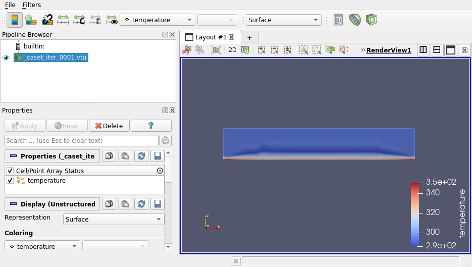

## Expansion depth XML hint for tree view

If a filter uses a tree widget (`ArrayListDomain`, `ArraySelectionDomain`, `EnumerationDomain`, `CompositeTreeDomain`), the default expansion depth can now be controlled with a specific hint. 0 is the minimal expansion depth where only the root node is expanded. -1 means expand all nodes.

  <IntVectorProperty command="..." name="...">
    <CompositeTreeDomain mode="all" name="tree">
      <RequiredProperties>
        <Property function="Input" name="Input" />
      </RequiredProperties>
    </CompositeTreeDomain>
    <Hints>
      <!-- This tag sets the height of the CompositeTreeDomain -->
      <Expansion depth="3" />
    </Hints>
  </IntVectorProperty>

## Support for testing in external plugins

ParaView now supports XML and Python testing within external plugins. When adding a XML testing to an external plugin, it is now possible to specify a variable, `testName_USES_DIRECT_DATA`, that will be picked up by ParaView's testing macros. With the variable defined, no data expansion will be performed which means that baseline can now be used without relying on an `ExternalData` mechanism and directly point to baseline image or data in the plugin subdirectory.

```cmake
set (TestName_USES_DIRECT_DATA ON)
paraview_add_client_tests(
  LOAD_PLUGIN PluginName
  PLUGIN_PATH $<TARGET_FILE_DIR:PluginName>
  BASELINE_DIR ${CMAKE_CURRENT_SOURCE_DIR}/Data/Baseline
  TEST_SCRIPTS TestName.xml)
```

When adding a Python test to an external plugin, it is now possible to specify a parameter to the `paraview_add_test_python` function, `DIRECT_DATA`, that will be picked up by VTK testing macro. With this parameter defined, no data expansion will be performed which means that baseline can now be used without relying on an `ExternalData` mechanism and directly point to baseline image
or data in the plugin subdirectory. In order to load the plugin in the Python script, it may be required to use other mechanisms, see in the elevation filter example.

```cmake
## Uses DIRECT_DATA to inform VTK to look into Data/Baseline/ for the baselines
paraview_add_test_python(
  NO_RT DIRECT_DATA
  TestPython.py)
```

See `Examples/Plugins/ElevationFilter` for a complete example.

## Adding argument lists for plugins and plugin paths to testing macros

The arguments `LOAD_PLUGINS` and `PLUGIN_PATHS` have been added to the testing macros, making it possible to test multiple plugins within a single test.

## Plugin directory structure loading

`PV_PLUGIN_PATH` now supports directories that hold the structure made by ParaView's plugin build macros. Namely, directories named `PluginName` found in these paths will trigger a search for `PluginName.dll` or `PluginName.so` (depending on platform) under that directory.

Plugin XML files (which list plugins and `auto_load` settings) may now specify a relative path to a plugin. When using a relative path, it must end up under the original XML file's directory (*i.e.*, using `..` to "escape" is not allowed).

## Loading of plugins

In earlier versions, plugins could be loaded before or after the main window in the application was created depending on whether the plugin was loaded using the **Load Plugin** dialog or was being auto-loaded. With recent changes, we are now assuring that plugins are always loaded **after** the main window is created. This assures that plugin developers can assume existence of a main window irrespective of whether the plugin was auto-loaded or loaded after the application has started.

## Plugin location properties

Multiple static plugin search functions may now be registered. The  `vtkPVPluginTracker::SetStaticPluginSearchFunction` is deprecated in favor of `vtkPVPluginTracker::RegisterStaticPluginSearchFunction`.

## Proxy XML for readers now supports multiple hints for file types

The `<Hints>` element in a reader proxy can now contain multiple entries to allow
a reader to support different file types with different descriptions.

An example of this use case is in the `ADIOS2CoreImageReader`:
```xml
<Hints>
  <ReaderFactory extensions="bp"
                 file_description="ADIOS2 BP3 File (CoreImage)" />
  <ReaderFactory filename_patterns="md.idx"
                 file_description="ADIOS2 BP4 Metadata File (CoreImage)" />
  <ReaderFactory extensions="bp"
                 is_directory="1"
                 file_description="ADIOS2 BP4 Directory (CoreImage)" />
</Hints>
```
This makes it possible for a single reader to present multiple entries in the "File -> Open"
dialog box rather than a single combined entry.

## Provide access to client-side selection

The `vtkSMRenderViewProxy` class now creates instances of a new `vtkPVEncodeSelectionForServer` class in order to prepare the client-side selection for representations on the server side. This allows applications built on ParaView a way to access the client-side selection while it is being processed.

## Unified bindings option has been removed

"Unified" bindings have been removed. This used the Python bindings as a backing implementation for the ClientServer bindings used for ParaView's client/server communication. It did not produce the expected results and is no longer useful.

## QTTesting additions

* `ItemView` widgets record and replay a double-click in addition to an edit event,
  so `TreeViews` that respond to double-click but not edit can be tested.
* `ItemView` widgets record and replay selection events in addition to `setCurrentItem`, so they can test multiple selections. This is useful in **SpreadSheet** view and color annotation widget, for example.
